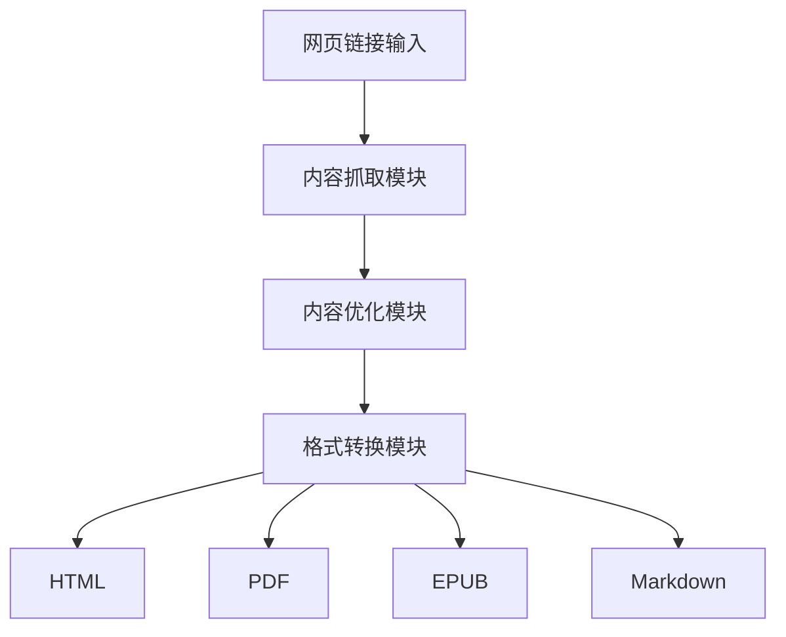
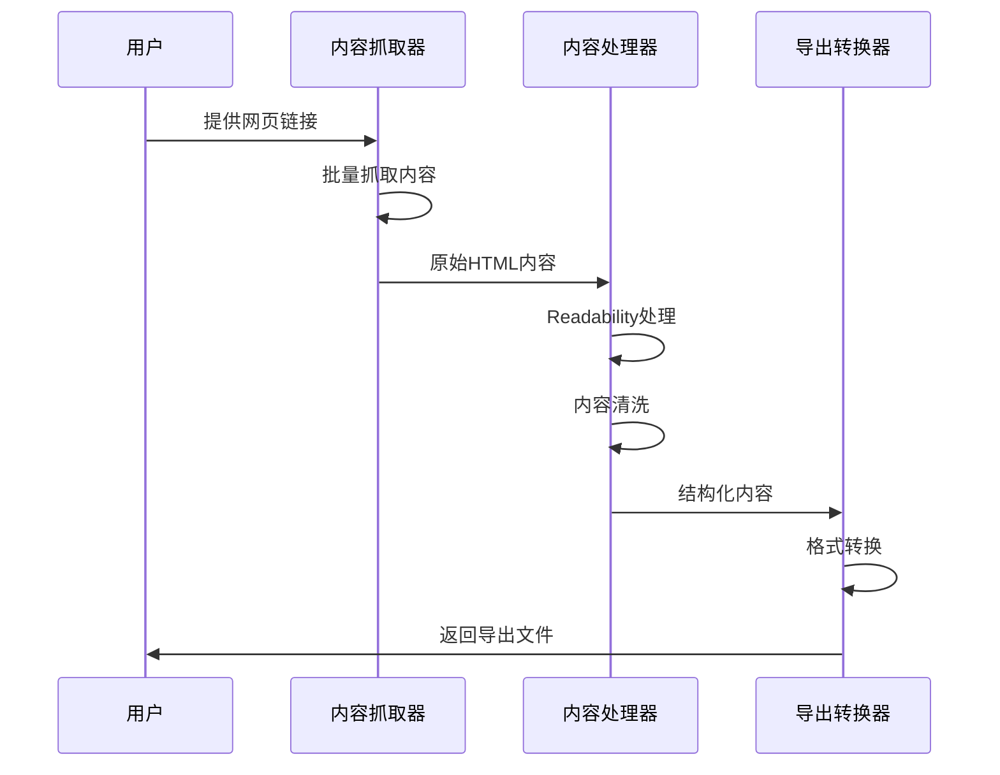
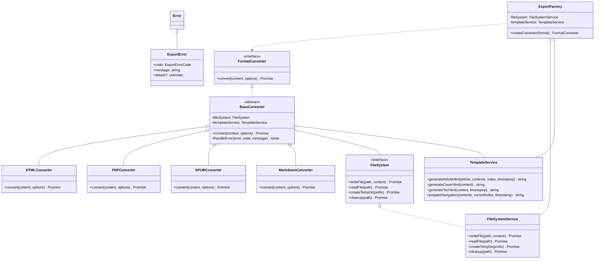

import ZoomImage from '@site/src/components/ZoomImage';

<ZoomImage src="https://s2.loli.net/2025/02/23/FdTcD6U5xHmp7Wh.png" alt="wepub流程图" />

最近一年我花了很多时间在使用微信读书上，通过类似[安娜的档案馆](https://zh.annas-archive.org/)的工具导入书籍，或者直接阅读微信读书的官方书城找书，但都无法解决一个问题：我希望阅读一些最新的工具的说明书，而且我希望能对这些说明书做好阅读笔记，方便后续的检索和二次创作。

[wepub](https://github.com/Wjiajie/wepub)这个小工具就是为了解决这个问题，它可以将网页转换为电子书，并支持多种格式，包括HTML、PDF、EPUB和Markdown，其中的PDF和EPUB格式方便导入微信读书做深度阅读和笔记，而HTML和Markdown格式方便我使用RAG的工具做后续的检索和二次创作。

你可以通过[wepub demo](https://wepub.vercel.app/)来体验这个工具的交互。但注意目前的demo是部署到类似vercel这样的平台，一些导出选项（如PDF和EPUB）会失败，因为目前的这些比较耗时的格式生成服务是在后端接口中实现，而vercel的免费版能提供的CPU资源有限制，目前我自测在vercel免费版是跑不起来这两个格式的导出服务的，可能需要使用者自己部署一个后端服务，或者尝试cloudflare这样的平台提供的cloudflare workers服务。

<!-- truncate -->

在本地调试没有这个限制，我建议你可以把[项目](https://github.com/Wjiajie/wepub)clone下来，然后本地运行这个工具。

## 本地调试

### 环境要求

- Node.js >= 18.0
- npm >= 8.0 或 yarn >= 1.22
- Git >= 2.0

### 安装步骤

1. **安装 Node.js 和 npm**
   Node.js 官方安装包通常会自动包含 npm，因此你只需要安装 Node.js 即可。你可以通过[官网](https://nodejs.org/zh-cn)安装Node.js和npm。
   ```bash
   # 检查版本
   node -v
   npm -v
   ```

2. **克隆项目**
   ```bash
   git clone git@github.com:Wjiajie/wepub.git
   cd wepub
   ```


3. **安装依赖**
   ```bash
   npm install
   # 或
   yarn install
   ```

4. **启动开发服务器**
   ```bash
   npm run dev
   # 或
   yarn dev
   ```

5. **构建生产版本**
   ```bash
   npm run build
   npm start
   ```
这样你能在本地调试环境内运行起来这个项目了，使用流程参照下面的小节。

### 使用流程

<ZoomImage src="https://s2.loli.net/2025/02/23/VomOzlDUP6wLTgX.png" alt="输入网页链接并抓取内容" />

这个工具要求你输入一个网页的链接，它会自动抓取当前网页以及子网页内容，你可以通过`最大页面数量`，`递归深度`来控制抓取的规模，通过`保留历史内容`来控制是否保留历史内容，保证这些内容暂时写进浏览器缓存中，刷新网页和解析新的链接也不会被清除。

<ZoomImage src="https://s2.loli.net/2025/02/23/hxXgmDSCU6brKIL.png" alt="抓取网页内容并通过列表展示" />

抓取的网页内容会通过列表展示，你可以选择是否保留这些内容，或者删除这些内容，或者可以只选择部分网页内容导出。

<ZoomImage src="https://s2.loli.net/2025/02/23/Lh4egFUlsyJAi1q.png" alt="配置导出选项" />

在点击导出后，配置导出的`文档标题`，`作者`，`更多说明`，并且选择导出的格式，目前支持HTML，PDF，EPUB和Markdown格式。

<ZoomImage src="https://s2.loli.net/2025/02/23/I2ZesAbyiPWxm4F.png" alt="网页内容导出中" />

点击确认后，工具会将网页内容发送到后端处理，并生成对应的导出文件，返回到浏览器中并下载。


## 实现流程

这个工具实现的流程如上所示：前端在用户输入网页链接后，会调用后端接口，后端接口会调用`内容抓取器`，`内容处理器`，`导出转换器`，`文件系统`等模块，最终生成对应的导出文件。
流程图如下：



时序图如下：



类图如下：



## 后续功能扩展

当前这个工具只做到了在本地调试环境可用，在生产环境中使用可能需要考虑到服务器成本，这块的维护暂时不会考虑，你可以自行部署一个后端服务，或者尝试cloudflare这样的平台提供的cloudflare workers服务。

针对导出的效果，后续这个[wepub](https://github.com/Wjiajie/wepub)项目会继续做一些扩展:

- 增加导出选项，支持更多格式，如DOCX，RTF，MOBI等。
- 支持外文网站在导出前先翻译为目标语言。

## 更多
感谢很多优先的开源项目为这个小工具的效果提供了有力的支持：

- [Next.js](https://nextjs.org/)：一个用于构建服务器端渲染（SSR）的React框架。
- [Tailwind CSS](https://tailwindcss.com/)：一个用于快速构建现代网站的CSS框架。
- [shadcn/ui](https://ui.shadcn.com/)：一个用于构建现代网站的UI组件库。
- [Mozilla Readability](https://github.com/mozilla/readability)：一个用于提取网页内容的JavaScript库。
- [Percollate](https://github.com/danburzo/percollate)：一个用于将网页转换为多种格式（PDF、EPUB、Markdown）的工具。

