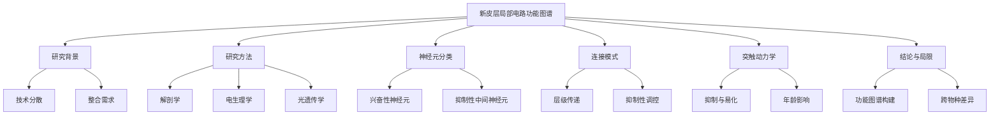

import ZoomImage from '@site/src/components/ZoomImage';

“Functional maps of neocortical local circuitry”由一组神经科学家撰写。本文旨在整合多种技术手段的数据，构建新皮层局部电路的功能连接图谱，为理论建模提供数值依据。研究方法包括解剖学研究、配对细胞内和全细胞记录技术，以及其他补充技术如笼状谷氨酸光解和电压敏感染料等。文章详细分类了新皮层中的兴奋性神经元和抑制性中间神经元，分析了它们的连接模式和突触特性。研究发现新皮层局部电路存在高度选择性的连接模式，抑制性中间神经元通过靶向特异性调控网络动态。尽管部分连接数据稀疏，跨物种和年龄的比较存在差异，但本文为理解新皮层功能模块化提供了重要的结构解释。论文链接见[这里](https://www.doubao.com/drive/s/43dd65deacea738b)。

<!-- truncate -->

# 新皮层局部电路功能图谱研究总结

## 论文章节总结
### 1. 引言
- 目标：整合不同技术手段的数据，构建新皮层局部电路的功能连接图谱，为建模提供数值依据。
- 方法：依赖解剖学研究、配对细胞内和全细胞记录技术，结合其他方法（如笼状谷氨酸光解、电压敏感染料等）补充数据。

### 2. 研究方法
- **解剖学研究**：通过高尔基染色、HRP标记等技术分析神经元类型和连接模式。
- **电生理记录**：配对细胞内和全细胞记录，分析突触连接的概率、幅度和动力学特性。
- **其他技术**：免疫荧光、单细胞RT-PCR、光遗传技术（ChR2/NpHR）、笼状谷氨酸光解等。

### 3. 神经元分类
- **兴奋性神经元**：包括各层的锥体细胞（如L5的IB和RS细胞）和L4的棘状星形细胞。
- **抑制性中间神经元**：分为靶向胞体/轴突起始段的篮状细胞、吊灯细胞，以及靶向树突的Martinotti细胞、双束细胞等。

### 4. 兴奋性连接
- **层间传递**：L4→L3→L5的单向传递为主，反向连接稀疏。
- **突触特性**：多数连接表现为短时程抑制（STP），NMDA受体介导的成分显著。

### 5. 抑制性连接
- **靶向特异性**：不同中间神经元类型选择性抑制锥体细胞的不同亚细胞区域。
- **突触动力学**：PV阳性中间神经元介导快速抑制，SOM阳性中间神经元介导慢抑制。

### 6. 突触动力学
- **抑制与易化**：低释放概率（p）连接以易化为主，高p连接以抑制为主。
- **年龄影响**：幼鼠突触动力学更慢，恢复时间常数更长。

## 论文核心要点
### 研究问题与目标
- **问题**：新皮层局部电路的连接模式及其功能特性缺乏系统性整合。
- **目标**：构建包含连接概率、突触特性的功能图谱，为理论建模提供数据基础。

### 方法与创新点
- **方法**：结合解剖学、电生理学、光遗传学等多技术手段。
- **创新点**：首次系统总结不同层和神经元类型的连接模式，提出“前馈为主，反馈抑制”的层级结构。

### 结论与局限性
- **结论**：新皮层存在高度选择性的连接模式，抑制性中间神经元通过靶向特异性调控网络动态。
- **局限性**：部分连接数据稀疏，跨物种和年龄的比较存在差异，切片培养可能影响突触特性。

## 数据支撑
1. **连接概率**：
   - L3→L5锥体细胞连接概率高达1:2（相邻细胞）。
   - L6→L4连接概率低（~3%），但L6 CT细胞优先抑制中间神经元。
2. **突触特性**：
   - 锥体细胞间EPSP幅度0.3-3.5 mV，抑制性突触IPSP幅度0.5-3.0 mV。
   - PV阳性中间神经元的抑制性突触具有快速动力学（τ < 10 ms）。
3. **动力学特性**：
   - 锥体细胞连接表现短时程抑制（STP），中间神经元连接表现易化（SF）。

## 结论
- 新皮层局部电路通过兴奋性锥体细胞的层级传递和抑制性中间神经元的靶向调控，形成高效的信息处理网络。
- 功能图谱为理解皮层计算机制提供了结构基础，但需结合动态特性进一步验证。

## 反思与总结
### 1. 这篇文章试图解决什么问题？它的重要性是什么？
- **问题**：新皮层局部电路的连接模式及其功能特性缺乏系统性整合。
- **重要性**：为理解大脑信息处理机制提供结构基础，支持神经计算模型的构建。

### 2. 作者提出了哪些假设或研究问题？
- **假设**：新皮层存在高度选择性的连接模式，抑制性中间神经元通过靶向特异性调控网络动态。
- **问题**：不同层和神经元类型的连接概率、突触特性如何？

### 3. 作者对相关领域的研究背景做了怎样的概述？他们是如何引出自己的研究的？
- **背景**：现有研究分散在解剖学、电生理学等领域，缺乏整合。
- **引出**：通过总结技术手段和现有数据，指出构建统一功能图谱的必要性。

### 4. 作者采用了哪种研究方法？这种方法适合研究这个问题吗？
- **方法**：多技术整合（解剖学、电生理学、光遗传学等）。
- **适用性**：适合，因单一技术无法全面解析复杂电路。

### 5. 研究的样本是什么？样本量足够吗？
- **样本**：猫、大鼠、小鼠的新皮层切片，涵盖不同年龄阶段。
- **样本量**：部分连接数据稀疏（如L6→L4），但关键连接有重复验证。

### 6. 作者是如何收集数据的？数据收集过程是否严谨？
- **数据收集**：依赖经典电生理记录和解剖学技术，结合新技术（如光遗传）。
- **严谨性**：方法描述详细，但部分实验受限于切片培养条件。

### 7. 作者使用了哪些统计分析方法？这些方法是否适合他们的数据？
- **方法**：连接概率计算、突触参数统计（幅度、动力学）。
- **适用性**：适合，但部分复杂动力学模型未深入验证。

### 8. 研究的主要发现是什么？
- 兴奋性连接以层级传递为主，抑制性中间神经元具有靶向特异性。
- 突触动力学特性与神经元类型和年龄相关。

### 9. 结果是否清晰地呈现？图表是否易于理解？
- **结果呈现**：清晰，通过表格和示意图总结连接模式。
- **图表**：表格数据详细，但部分示意图需结合文字说明。

### 10. 结果是否支持作者的假设？
- **支持**：证实了连接选择性和抑制性调控的重要性。

### 11. 结果是否具有统计显著性？实际意义如何？
- **显著性**：关键连接数据（如L3→L5）具有统计学意义。
- **实际意义**：为皮层功能模块化提供结构解释。

### 12. 作者如何解释他们的发现？解释是否合理？
- **解释**：强调层级传递和抑制性调控的协同作用。
- **合理性**：符合现有理论，但部分机制需进一步验证。

### 13. 发现与之前的研究有何联系？对领域有何贡献？
- **联系**：补充了中间神经元的功能多样性。
- **贡献**：首次系统整合多技术数据，构建功能图谱。

### 14. 作者是否提到了研究的局限性？对结果有何影响？
- **局限性**：部分连接数据不足，跨物种差异未明确。
- **影响**：需谨慎推广至其他物种或脑区。

### 15. 对未来研究的建议？
- 结合活体成像技术，深入研究突触可塑性和动态调控机制。

## 思维导图
