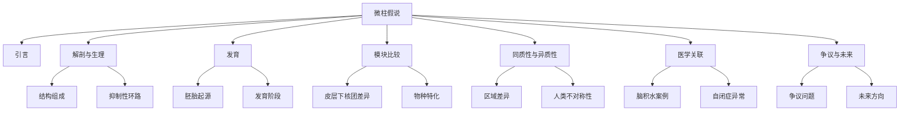

import ZoomImage from '@site/src/components/ZoomImage';

“The minicolumn hypothesis in neuroscience”由Daniel P. Buxhoeveden和Manuel F. Casanova撰写，发表于*Brain* 2002年6月。本文系统综述了微柱作为皮层组织基本单位的解剖、生理及功能特性，强调其异质性和动态性在神经可塑性和疾病中的潜在作用。尽管微柱理论仍存在争议，但其为理解皮层功能提供了跨学科框架，未来需结合多技术手段深入研究其发育机制与疾病关联。论文链接见[这里](https://www.doubao.com/drive/s/d01cd6e8e195d783)。

<!-- truncate -->

# 文档分析报告

## 论文章节总结
### 引言
- 介绍皮层微柱（minicolumn）作为神经科学研究的核心问题，强调其在皮层组织中的基础作用。
- 回顾自Mountcastle（1957）提出柱状组织理论以来的研究进展，指出微柱作为最小垂直功能单位的争议与重要性。

### 皮层微柱的基本解剖与生理学
- 微柱由约80-100个神经元组成，垂直贯穿皮层II-VI层，包含兴奋性和抑制性神经元。
- 描述微柱的结构特征（如细胞排列、纤维束走向）及其与宏观柱（macrocolumn）的关系。
- 强调抑制性中间神经元（如篮状细胞、吊灯细胞）在局部环路中的关键作用。

### 微柱的发育解剖学
- 胚胎期皮层的放射状细胞柱是成年微柱的前体，其形成与神经元迁移模式密切相关。
- 人类胎儿皮层发育显示微柱在妊娠24-28周开始分层，出生时宽度约为成年的1/3。

### 微柱与模块
- 区分微柱与皮层下核团的差异，指出微柱的局部连接性、多功能性及水平-垂直叠加特性。
- 讨论模块化组织在不同物种和皮层区域的表现（如啮齿类的桶状皮层）。

### 皮层同质性与异质性
- 皮层整体结构高度相似，但微柱在尺寸、细胞密度、神经毡空间等方面存在区域和物种差异。
- 人类语言相关区域（如颞平面）的微柱存在不对称性，可能与功能特化相关。

### 医学异常与微柱
- 脑积水、半脑切除等病例显示皮层功能可在大范围损伤后保留，支持微柱的冗余性和可塑性。
- 自闭症、精神分裂症等疾病中可能存在微柱结构异常。

## 论文核心要点
### 研究问题与目标
- 探讨微柱作为皮层基本功能单位的解剖学、生理学及进化意义。
- 解释微柱在神经发育、疾病和认知功能中的作用。

### 方法与创新点
- 方法：结合解剖学观察、电生理记录、代谢标记（2DG）、计算机建模及比较神经学分析。
- 创新点：提出微柱是皮层组织的基本模板，强调其双重组织模式（水平分层与垂直整合）。

### 结论与局限性
- 结论：微柱是皮层功能的核心单位，其结构异质性支持区域特化，为理解脑进化和疾病提供新视角。
- 局限性：未明确微柱独立于宏观柱的功能，部分争议（如细胞排列的真实性）仍需解决。

## 数据支撑
1. **解剖学数据**  
   - 不同物种（小鼠、猫、猴、人类）微柱宽度范围为20-60μm（Nissl染色分析）。
   - 人类颞平面微柱存在左右半球不对称性（左半球更宽，神经毡空间更大）。

2. **生理学实验**  
   - 电生理记录显示单个微柱对应特定感受野（猫、猴体感皮层）。
   - 2DG代谢标记与内在光学信号（IOS）证实微柱水平的功能活动。

3. **发育研究**  
   - 人类胎儿皮层微柱中心间距在妊娠14-42周从4.6μm增至14.1μm。

4. **疾病案例**  
   - 脑积水患者保留认知功能，提示微柱的冗余性。
   - 自闭症患者微柱间距减小，神经毡空间减少。

## 结论
- 微柱是皮层组织的基本功能单位，兼具结构同质性与功能异质性。
- 其垂直整合与水平分层的双重模式为皮层的高效信息处理提供了基础。
- 微柱异常可能参与多种神经发育和精神疾病的病理机制。

## 反思与总结
* 这篇文章试图解决什么问题？它的重要性是什么？  
  [文章试图明确微柱在皮层组织中的核心地位，解释其在神经功能、进化和疾病中的作用。重要性在于为理解大脑的模块化组织提供统一框架，推动神经科学与临床研究的结合。]

* 作者提出了哪些假设或研究问题？  
  [假设微柱是皮层的基本功能单位，具有双重组织模式（垂直与水平整合）。研究问题包括微柱的结构异质性、发育机制及其在疾病中的作用。]

* 作者对相关领域的研究背景做了怎样的概述？他们是如何引出自己的研究的？  
  [回顾自Mountcastle提出柱状理论以来的争议，指出微柱作为最小功能单位的解剖学和生理学证据逐渐积累，但在进化、疾病等领域的应用尚未充分开发。通过整合多学科研究，提出微柱是连接结构与功能的关键。]

* 作者采用了哪种研究方法（例如，实验、调查、案例研究等）？这种方法适合研究这个问题吗？  
  [方法包括解剖学分析、电生理记录、代谢标记、计算机建模及比较神经学。这些方法适合探讨微柱的结构-功能关系，但部分结论依赖间接证据（如代谢标记与细胞排列的关联）。]

* 研究的样本是什么？样本量足够吗？样本是否具有代表性？  
  [样本涵盖小鼠、大鼠、猫、猴及人类的皮层组织，部分实验（如人类病例）样本量较小。物种多样性增强了结论的普遍性，但人类数据受限于伦理获取。]

* 作者如何解释他们的发现？他们的解释是否合理？  
  [将微柱的异质性归因于环境影响和遗传调控，认为其结构差异支持功能特化。解释合理，但部分推论（如微柱在疾病中的因果作用）需更多实验验证。]

* 作者的发现与之前的研究有什么联系？他们的研究对该领域有什么贡献？  
  [整合了Mountcastle、Rakic等学者的经典理论，提出微柱的双重组织模式和冗余性。贡献在于强调微柱作为皮层组织的基本模板，为比较神经学和疾病机制提供新视角。]

* 作者是否提到了研究的局限性？这些局限性对研究结果的解释有什么影响？  
  [未明确微柱独立于宏观柱的功能，部分争议（如细胞排列的真实性）仍需解决。这些局限提示结论需谨慎推广，尤其在功能层面。]

## 思维导图
