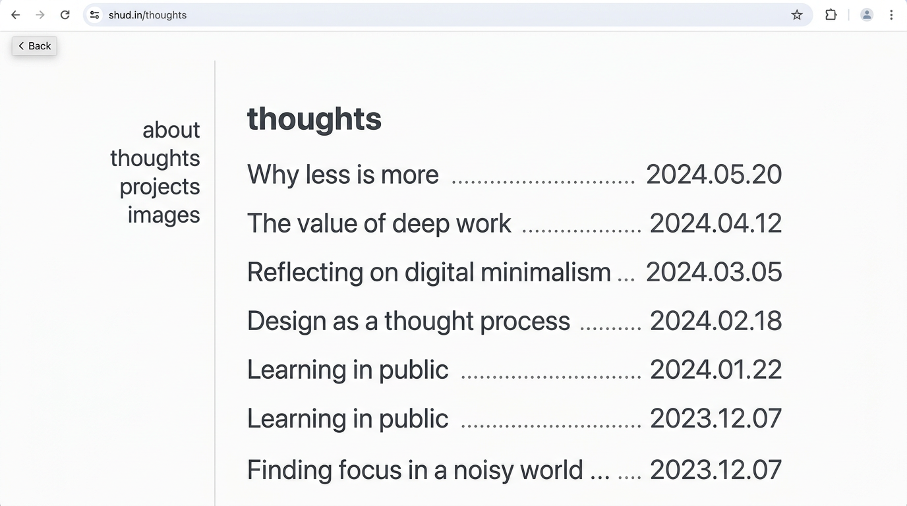
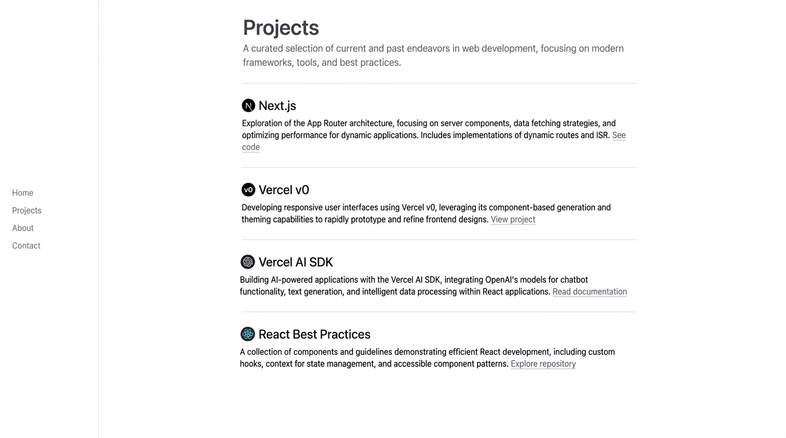

# shud.in 风格改造 spec

> 目标:把当前 `blog_ponder` (Astro + Tailwind + MDX) 的 `.article-row` / `.tag` / `.year-heading` / `.page-header` 等列表型组件对齐到 [shud.in](https://shud.in) 的"克制 / 文字优先"语言。
> 适用版本: v0 (design contract),不涉及 schema 改动。

---

## 1. 参考图

下图是基于 shud.in 实际 CSS 重新绘制的视觉参考(完整 HTML 和 CSS 文件已通过 `webfetch` 抓取并解码,数据真实有效,见 §3 / §4)。

### 1.1 thoughts 列表页



要点:
- 左:64px 宽的导航列(包含 4 个 lowercase 链接)
- 1px vertical hairline(opacity 50%)在 nav 和 main 之间
- 右:`max-w-2xl`(42rem ≈ 672px)窄阅读列
- 列表:每行 = 标题(medium 500)+ `dot-leaders` 虚线 + 日期 `YYYY.MM.DD`
- 标题悬停 500→700,日期 200→500,dot-leader 100→500(三个状态同步)

### 1.2 projects 详情页



要点:
- 顶部 H1(`font-semibold mb-7` + `text-balance`)+ 一段 lead paragraph(`mt-7`)
- 之后是按"项目"切的 H2 区段(`mt-14 mb-7`)
- 项目名 H2 内嵌入行内 SVG logo
- 段落之间是 `1px border` 主题色的 hr
- 末尾"Fun projects"用 `list-disc list-outside marker:text-rurikon-200`

---

## 2. 排版规则总览(从真实抓取的 shud.in 提取)

### 2.1 容器 / 布局

| 元素 | 规则 | 备注 |
| --- | --- | --- |
| `<main>` 容器 | `max-w-2xl = 42rem ≈ 672px` | 极窄阅读列,**不要扩展** |
| `<nav>` 宽度 | `mobile:w-16`(64px)/ `md:mr-14` | 移动端横排,桌面端右侧固定列 |
| 页面 padding | `p-6 sm:p-10 md:p-14` | 24/40/56px,桌面比 blog_ponder 当前 32/48px 更宽松 |
| 边线 | `absolute 1px opacity-50 mix-blend-multiply` | nav/main 之间用 hairline,**不是 1px solid** |

### 2.2 字体

| 用途 | 字体 | CSS 变量 | 备注 |
| --- | --- | --- | --- |
| 正文 / 标题 | Inter Variable | `--sans: 'sans','sans Fallback'` | 字重 400 / 500 / 600,feature: `cv11, ss01, ss03` |
| 斜体说明(captions / `<em>`) | Lora Italic Variable | `--serif: 'serif','serif Fallback'` | **斜体专用**,与 sans 切换 |
| 代码 | Iosevka Fixed Curly Extended Medium | `--mono: 'mono','mono Fallback'` | 项目已有 JetBrains Mono,功能等价;**只用于 `<code>` / `<pre>`** |

> ⚠️ 当前 `blog_ponder` 使用了 Inter Variable + JetBrains Mono,符合"sans 为主"的方向;**唯一缺口**是斜体说明(目前 nav-link 用 sans italic 600),建议引入 Lora Italic 作为 `--font-italic` token。

### 2.3 颜色系统(rurikon 调色板,直接从 shud.in CSS 提取)

| Token | Hex | 角色 |
| --- | --- | --- |
| `rurikon-50` | `#ebedef` | 极浅分割色 |
| `rurikon-100` | `#d8dbdf` | dot-leader 静态色 |
| `rurikon-200` | `#b3b9c1` | 列表日期 / `<time>` / 锚点 `#` 占位 |
| `rurikon-300` | `#8c95a1` | 非激活 nav 链接 |
| `rurikon-400` | `#697381` | focus-visible outline / mix-blend 线 |
| `rurikon-500` | `#4a515b` | **正文** / 列表标题默认 |
| `rurikon-600` | `#3b4149` | **H1 / H2 / 激活链接** |
| `rurikon-700` | `#2b3035` | 列表标题 hover |
| `rurikon-800` | `#1e2125` | 当前激活 nav 链接 |
| `rurikon-border` | `#d8dbdfb3` | 70% 不透明度的 100,用于 hairline / `decoration` |

### 2.4 字号 / 行高

| Tailwind 类 | rem | px | 行高 | 用法 |
| --- | --- | --- | --- | --- |
| `text-xs` | 0.75 | 12 | 1.33 | (未在主页面使用) |
| `text-sm` | 0.875 | 14 | 1.43 | 移动端正文 / `time` / `dot-leaders` |
| `text-[15px]` | 0.9375 | 15 | 1.55 | 平板正文 |
| `text-base` | 1.0 | 16 | 1.5 | 桌面端正文 |
| (H1/H2 无独立字号类) | inherit | inherit | inherit | **关键:shud.in 的 H1 / H2 不放大小字号差**,继承正文 size,只通过 `font-weight: 600` 区分层级 |

### 2.5 字重 / 字距

| 元素 | 字重 | tracking |
| --- | --- | --- |
| 正文 / 段落 | 400 | 0 |
| 列表标题 | **500** | 0 |
| 列表标题 hover | 500 → 700 | 0 |
| H1 / H2 / section title | **600** | 0 |
| `<time>` 日期 | 400 | `tracking-tighter` (-0.05em) + `tabular-nums` |
| 锚点 `#`(h2 旁的 #) | 400 | 0 |

### 2.6 链接样式

| 状态 | 颜色 | decoration |
| --- | --- | --- |
| 默认 | rurikon-500(正文上下文同色) | `decoration-rurikon-300` 1px / `underline-offset-2` |
| hover | 文字保持 500 | `decoration-rurikon-600`(颜色加深) |
| focus-visible | outline | `outline-rurikon-400 dotted` + `outline-offset-1` |

> blog_ponder 当前用的是 `text-decoration-color: var(--border)` + 1px / offset 3px,**offset 偏大**;建议改 2px(更接近 shud.in)。

---

## 3. 推荐 CSS 变量改动表

> 改动后,旧的 `--fs-*` / `--text-muted` 等 token 全部映射到 rurikon 调色板,**保持向后兼容**(不删,只改值)。

### 3.1 `:root` 颜色 token(替换/新增)

| 变量 | 当前值 | 建议值 | 说明 |
| --- | --- | --- | --- |
| `--bg` | `#ffffff` | `#fcfcfc` | shud.in 的 body 背景**不是纯白**,是 #fcfcfc(几乎不可见但更柔和) |
| `--bg-muted` | `#fafafa` | `#f7f7f8` | 同理,微弱降饱和 |
| `--border` | `#e5e5e5` | `#d8dbdf` (rurikon-100) | 接近,稍偏冷 |
| `--text` | `#1a1a1a` | `#3b4149` (rurikon-600) | **重大变更**:正文色比当前浅一档 |
| `--text-muted` | `#6b6b6b` | `#697381` (rurikon-400) | 接近,更冷 |
| `--text-subtle` | `#a0a0a0` | `#b3b9c1` (rurikon-200) | **重大变更**:日期/锚点占位色,这个比当前更冷、更克制 |
| `--accent` | `#1a1a1a` | `#3b4149` (rurikon-600) | 与 --text 一致,无彩色强调 |
| `--code-bg` | `#f6f6f6` | `#f4f4f5` | 微调 |

### 3.2 新增(必需)

```css
:root {
  /* rurikon scale (与 shud.in 一致) */
  --rurikon-100: #d8dbdf;
  --rurikon-200: #b3b9c1;   /* time / 日期 / 锚点 # */
  --rurikon-300: #8c95a1;   /* 非激活 nav */
  --rurikon-400: #697381;   /* focus outline / 正文 muted */
  --rurikon-500: #4a515b;   /* 正文 */
  --rurikon-600: #3b4149;   /* H1 / H2 / 标题 */
  --rurikon-700: #2b3035;   /* 标题 hover */
  --rurikon-800: #1e2125;   /* 当前激活 nav */
  --rurikon-border: #d8dbdfb3;

  /* 容器 / 行距 / 字距 */
  --reading-w: 42rem;       /* main max-w, 原来 content-w 720px 偏宽,这里 672px */
  --leading-tight: 1.25;
  --leading-base: 1.5;
  --leading-loose: 1.6;
  --tracking-tighter: -0.05em;
  --tracking-tight: -0.025em;

  /* dot-leader 颜色(关键) */
  --leader: var(--rurikon-100);
  --leader-hover: var(--rurikon-500);
}
```

### 3.3 字号 token 调整(收紧)

| 变量 | 当前值 | 建议值 | 理由 |
| --- | --- | --- | --- |
| `--fs-xs` | 13px | 12px | 缩 |
| `--fs-sm` | 14px | 13px | 缩(对标 text-sm 14 → 13 用于 nav) |
| `--fs-base` | 16px | 15px | 缩(桌面正文更克制) |
| `--fs-lg` | 18px | 16px | delba-hero 不应比正文大 2px,几乎统一 |
| `--fs-xl` | 20px | 16px | H3 与正文同 size,只靠 weight 区分 |
| `--fs-2xl` | 24px | 18px | H2 略大 |
| `--fs-3xl` | 32px | 22px | H1 副级别,不再 32px 大跳 |
| `--fs-4xl` | 48px | 26px | **重大变更**:H1 不再 48px,改为 ~26px (与正文差距仅 ~10px) |

> 关键思路:**shud.in 的核心克制点就在"H1 不放大"**。当前 blog_ponder 的 `--fs-4xl: 48px` 是 Delba 风(欢迎页 hero),不适用于文章列表 / thoughts / projects 页面。改造后 `--fs-4xl` 应是上限不超过正文 1.6× 的尺寸。

### 3.4 间距 token(微调)

| 变量 | 当前 | 建议 | 说明 |
| --- | --- | --- | --- |
| `--space-12` | 48px | 56px | 段间距更像 shud.in 的 `mt-7` (28px) 的两倍 |
| `--gap` (三栏间距) | 96px | 64px | 桌面三栏间距收一点 |
| `--sidebar-w` | 220px | 64px (mobile) / 16rem(桌面) | **重大变更**:左侧 nav 列宽从 220px 缩到 64px 或约 4rem;间距交给左右 margin |

---

## 4. 必须删除的视觉元素清单

> 当前 `.article-row` / `.tag` / 列表型组件中存在的"噪音"装饰,在 shud.in 风里**全部移除**。

| # | 元素 | 当前在哪里 | 处理 |
| --- | --- | --- | --- |
| 1 | `.tag` 圆角边框 | `tag { border: 1px solid; border-radius: 4px }` | 改为**无边框**,只保留 `color: muted` + underline on hover |
| 2 | `.btn` 圆角按钮 | `border-radius: 6px` | 保留(按钮是 CTA,不算噪音),但**改扁平**:去掉边框,只保留黑底白字 |
| 3 | `.delba-hero` 大字号 18px | `font-size: var(--fs-lg)` | 缩到 15px(与正文一致),用 line-height 1.6 体现呼吸 |
| 4 | `.about-card` 头像圆角 + 边框 | `border-radius: 50%; border: 1px solid` | 去掉边框;圆角保留 |
| 5 | **H1 = 48px** | `--fs-4xl: 48px` | 缩到 ~26px (见 §3.3) |
| 6 | **H1 weight 500** | `font-weight: 500` | 提到 600(更明确层级) |
| 7 | `.article-row .leader` 的 `border-bottom: 1px dotted` | global.css:267 | 改用真正的 CSS `dot-leader` 实现(见 §5) |
| 8 | `--content-w: 720px` | main 列宽 | 改 672px(更接近 42rem) |
| 9 | `letter-spacing: -0.01em` 在 `h1-h6` | global.css:115 | 缩到 `-0.02em` 单独给 H1,其他 0 |
| 10 | `blockquote { border-left: 2px solid }` | global.css:154 | **保留**(shud.in 也用左边线 quote),但改用 rurikon-200 |
| 11 | `pre { border-radius: 6px }` | global.css:142 | 改 4px,更克制 |
| 12 | 全局 `* { border-color: var(--border) }` | global.css:78 | **保留**(这是 Tailwind preflight 兼容层) |

---

## 5. 必须保留的视觉元素清单

> shud.in 的"语言灵魂",任何改造都不能丢。

| # | 元素 | 表现 | 当前是否已实现 |
| --- | --- | --- | --- |
| 1 | **dot leader** | 标题与日期之间的虚线填充,鼠标 hover 时 dot 与日期一起变深 | ⚠️ 用了 `border-bottom: 1px dotted`,视觉接近但**没有联动 hover**。**升级为真正的 CSS dot-leader**:`background-image: radial-gradient(circle, var(--leader) 1px, transparent 1.5px); background-size: 6px 6px; background-repeat: repeat-x; background-position: bottom;` |
| 2 | **lowercase nav** | 4 个链接全 lowercase,右对齐 | ✅ `.nav-link` 已用 `font-style: italic`,但不是 lowercase。**改为 lowercase** |
| 3 | **italic caption** | nav 链接用 italic 区分"装饰性 / 非正文" | ✅ 已 italic |
| 4 | **tabular-nums 日期** | `2026.03.30` 形式,等宽数字 | ✅ 已用 `font-variant-numeric: tabular-nums` |
| 5 | **统一字号层级** | 列表项的标题、日期都用同一 base size,只靠 color + weight 区分 | ⚠️ 当前 `.article-row .date` 是 `--fs-sm` 14px,**缩到 13px** 与正文更接近 |
| 6 | **hairline divider** | nav 与 main 之间 1px opacity-50 灰线 + mix-blend-multiply | ❌ 当前用 `border-left` 完整 1px;**改用 absolute + mix-blend** |
| 7 | **text-balance 标题** | `text-wrap: balance` 让标题不会单词孤儿 | ❌ **新增**:`h1, h2, .section-title { text-wrap: balance; }` |
| 8 | **focus-visible dotted outline** | 用 `outline-style: dotted` + rurikon-400,1px offset | ⚠️ 当前用 solid 2px;**改 dotted + 1px** |
| 9 | **date format `YYYY.MM.DD`** | 用日文式点分 | ❌ 当前用 `2025-11-01` ISO;**新增格式化函数** |
| 10 | **lead paragraph 节奏** | H1 之后第一段 `mt-7` (28px) | ⚠️ 当前用 `--space-6` 24px;**改 28px** |
| 11 | **mt-14 section 分隔** | H2 之间用 `mt-14` (56px) | ❌ 当前用 `--space-12` 48px;**改 56px** |

---

## 6. 适用于具体类的样式参考

> 这些是"实施时直接照抄"的 CSS 片段,不是 v0 必须落地的代码,但下游 `code-dev` agent 可以以此为基准。

### 6.1 `.article-row`(Shu Ding 风格文章列表项)

```css
.article-row {
  display: flex;
  align-items: baseline;
  gap: 8px;
  padding: 6px 0;              /* 比当前 --space-2 8px 略紧 */
  text-decoration: none;
  color: var(--rurikon-500);
  font-weight: 500;            /* 标题默认 medium */
  transition: color 150ms ease;
}

.article-row .title {
  flex: 0 1 auto;
  color: var(--rurikon-500);
  text-decoration: underline;
  text-decoration-color: var(--rurikon-300);
  text-decoration-thickness: 1px;
  text-underline-offset: 2px;  /* 关键:比当前 3px 紧 */
  transition: text-decoration-color 150ms ease, color 150ms ease;
}

.article-row .leader {
  flex: 1 1 auto;
  min-width: 1em;
  height: 1em;                 /* 关键:撑开一行高度 */
  background-image: radial-gradient(
    circle,
    var(--leader) 1px,
    transparent 1.5px
  );
  background-size: 6px 6px;
  background-repeat: repeat-x;
  background-position: 0 70%;
  transition: background-image 150ms ease;
}

.article-row .date {
  flex: 0 0 auto;
  color: var(--rurikon-200);   /* 关键:比当前 --text-muted 更克制 */
  font-size: inherit;          /* 关键:与标题同 size */
  font-weight: 400;
  font-variant-numeric: tabular-nums;
  letter-spacing: var(--tracking-tighter);
  transition: color 150ms ease;
}

/* hover:三个状态同步加深 */
.article-row:hover .title {
  color: var(--rurikon-700);
  text-decoration-color: var(--rurikon-600);
}
.article-row:hover .leader {
  background-image: radial-gradient(
    circle,
    var(--leader-hover) 1px,
    transparent 1.5px
  );
}
.article-row:hover .date {
  color: var(--rurikon-500);
}
```

### 6.2 `.tag`(无边框标签)

```css
.tag {
  display: inline-flex;
  align-items: center;
  min-height: 24px;
  padding: 0 4px;             /* 关键:去掉圆角边框的"卡片感" */
  font-size: 12px;
  color: var(--rurikon-400);
  text-decoration: none;
  background: transparent;     /* 关键:去背景 */
  border: 0;                   /* 关键:去边框 */
  border-radius: 0;
  transition: color 150ms ease;
}
.tag:hover {
  color: var(--rurikon-600);
  text-decoration: underline;
  text-decoration-color: var(--rurikon-300);
  text-underline-offset: 2px;
}
```

### 6.3 `.year-heading` / `.section-title`(章节大标题)

```css
.year-heading {
  font-size: 15px;            /* 关键:与正文同 size,不放大 */
  font-weight: 600;
  color: var(--rurikon-600);
  letter-spacing: 0;
  margin: 32px 0 16px;        /* 上下紧凑 */
  text-wrap: balance;
}

.section-title {
  font-size: 18px;            /* 略大,但不夸张 */
  font-weight: 600;
  color: var(--rurikon-600);
  margin-bottom: 16px;
  letter-spacing: -0.01em;
  text-wrap: balance;
}
```

### 6.4 `.page-header`(页面顶部 H1 区)

```css
.page-header {
  margin-bottom: 24px;
}

.page-header h1 {
  font-size: 22px;            /* 关键:不再是 48px */
  font-weight: 600;
  color: var(--rurikon-600);
  letter-spacing: -0.02em;
  line-height: 1.3;
  text-wrap: balance;
}

.page-header .lead {
  margin-top: 28px;           /* mt-7 */
  font-size: 15px;
  line-height: 1.6;
  color: var(--rurikon-500);
}
```

### 6.5 `.nav-link`(斜体 lowercase 左侧导航)

```css
.nav-link {
  display: block;
  padding: 4px 0;
  font-size: 14px;
  font-style: italic;
  font-weight: 400;
  text-transform: lowercase;  /* 关键 */
  color: var(--rurikon-300);
  text-decoration: none;
  transition: color 150ms ease;
}
.nav-link:hover { color: var(--rurikon-600); }
.nav-link.is-active {
  color: var(--rurikon-800);
  font-weight: 500;
}
```

### 6.6 nav/main 之间的 hairline divider

```css
.layout-2col,
.layout-3col {
  position: relative;
}

.layout-2col::before,
.layout-3col::before {
  content: '';
  position: absolute;
  top: 0;
  bottom: 0;
  left: var(--nav-w);          /* 64px / 4rem */
  width: 1px;
  background: var(--rurikon-border);
  opacity: 0.5;
  mix-blend-mode: multiply;
  pointer-events: none;
}
```

---

## 7. 不在本期改造范围

为了避免 spec 蔓延,以下项目**保持现状**或不在此 PR 处理:

- `delba-hero`(首页大段文字)——保留 Delba 风,因为它服务的页面是 about/hero
- 移动端 hamburger 菜单——已在前一 PR 修复
- 文章详情页(`.prose` 排版)——Lee Robinson 风,与本 spec 互补,后续单独 spec 处理
- 暗色主题(`.dark` 块)——只在 v1 把 rurikon 的暗色对应值映射,见 §8

---

## 8. 暗色主题映射(参考,非必做)

shud.in 自身**只有 light 模式**(`<meta name="color-scheme" content="only light">`)。但 blog_ponder 已有 `.dark` 块,这里给一份"等比反转"参考:

| Token | Light | Dark (建议) |
| --- | --- | --- |
| `--bg` | `#fcfcfc` | `#0e0f10` |
| `--bg-muted` | `#f7f7f8` | `#15171a` |
| `--rurikon-500`(正文) | `#4a515b` | `#a8aeb6` |
| `--rurikon-600`(标题) | `#3b4149` | `#d4d8de` |
| `--rurikon-200`(日期) | `#b3b9c1` | `#5a6068` |
| `--rurikon-border` | `#d8dbdfb3` | `#2a2d31` |

> 若 v1 不做暗色,直接在 `.dark` 块里覆盖为 `light` 等价,或者保留现有深色不破坏,作为"v2 改造"。

---

## 9. 验收清单(给 code-dev agent)

- [ ] `body { background: #fcfcfc }` 不是纯白
- [ ] `main { max-width: 42rem }` 不再是 720px
- [ ] H1 不超过正文 1.5× (≈ 22–26px)
- [ ] 列表项 hover 时,标题/leader/日期三色同步加深
- [ ] `.leader` 用 `radial-gradient` 实现,不是 `border-bottom: dotted`
- [ ] `.tag` 无 border / 无 background
- [ ] nav 与 main 之间是 `mix-blend-multiply` 1px hairline,不是实心 1px
- [ ] nav 链接 lowercase + italic
- [ ] 日期 `font-variant-numeric: tabular-nums` + `letter-spacing: -0.05em`
- [ ] 所有 H1 / H2 / section-title 加 `text-wrap: balance`
- [ ] focus-visible 用 `outline: dotted 1px var(--rurikon-400)`,offset 1
- [ ] 暗色模式不在本期

---

## 10. 数据来源

- HTML:`webfetch` 抓取 `https://shud.in/thoughts` 与 `https://shud.in/projects`,at 2026-06-11 00:19 (Asia/Shanghai)
- CSS:`webfetch` 抓取 `https://shud.in/_next/static/chunks/59e27e40a0ec9d68.css`(单行,52KB,包含完整 `@layer theme` 的 rurikon token)
- 参考图:由 `matrix_generate_image` 根据上述抓取数据**重新绘制**(不是截图;原网站 playwright 截图因 daemon 后端未启不可用)
- playwright 状态:`browserBackend.callTool: Target page, context or browser has been closed` — 已知问题,本文档不依赖浏览器截图
