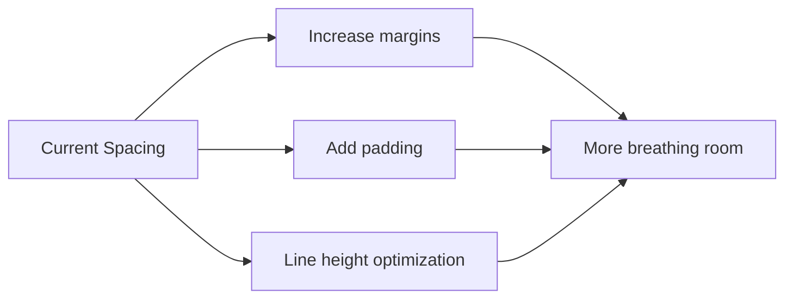
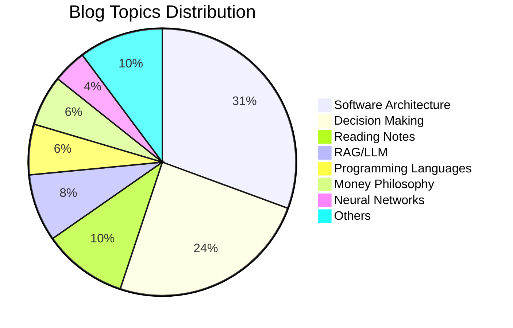
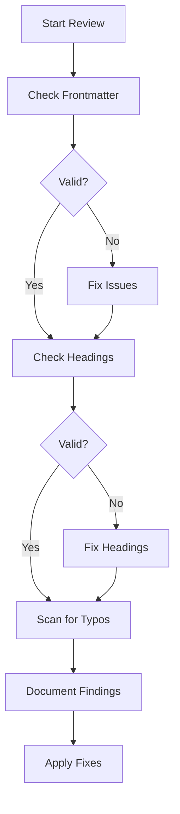
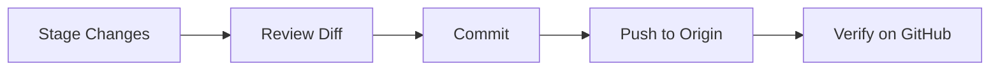

# Ponder Blog Refactor Plan

## Overview

This plan outlines the refactoring of the Ponder blog to achieve a more minimalist, Zen-inspired design, along with adding an About Me page, checking all articles for structure and typos, and committing changes to GitHub.

---

## Task 1: Zen Style Design Refactor

### Current State Analysis

The current CSS already has a "Zen Guide: Paper & Ink Palette" foundation with:
- Warm paper white background: `#fdfbf7`
- Deep ink grey text: `#2c3e50`
- Muted slate primary color: `#5D707F`
- Noto Serif SC font for titles

### Proposed Improvements

#### 1.1 Increase Whitespace



**Specific Changes:**
- Increase `--ifm-line-height-base` from `1.8` to `2.0`
- Add more vertical spacing between sections: `4rem` -> `6rem`
- Increase paragraph margins for better readability
- Widen content max-width slightly for a more spacious feel

#### 1.2 Simplify Color Palette

| Element | Current | Proposed |
|---------|---------|----------|
| Background | `#fdfbf7` | `#faf9f6` - slightly cooler white |
| Text | `#2c3e50` | `#3a3a3a` - softer grey |
| Primary | `#5D707F` | `#7a8b8c` - muted sage |
| Accent | Various | Single accent color |

#### 1.3 Remove Visual Clutter

- Remove remaining box-shadows
- Simplify borders to single pixel lines
- Replace gradients with solid colors
- Reduce button styling to minimal outlines

#### 1.4 Typography Enhancements

- Increase font size for body text: `1.05rem` -> `1.1rem`
- Improve letter-spacing for headings
- Add subtle text rendering optimizations

### Files to Modify

- [`src/css/custom.css`](src/css/custom.css) - Main stylesheet
- [`src/pages/index.module.css`](src/pages/index.module.css) - Homepage styles
- [`src/components/`](src/components/) - Component-specific styles

---

## Task 2: About Me Page

### Blog Interest Topics Summary

Based on analysis of 45 blog posts, the main interest categories are:



### Key Topics:

1. **Software Architecture** - SOLID principles, design patterns, Nanobot project series
2. **Decision Making** - Mental models, career choices, thinking frameworks
3. **Reading & Writing** - Book notes, writing workflows, learning methods
4. **AI/ML Technology** - RAG, LLM, Transformer architectures
5. **Programming** - C++ deep dives, smart pointers, move semantics
6. **Life Philosophy** - Money relationships, personal growth

### Author Profile

From [`blog/authors.yml`](blog/authors.yml:1):
- **Name**: Jiajie Wu
- **Title**: A new sailor - exploring the vast ocean of knowledge
- **Profession**: Graphics Engineer
- **Interests**: Coding, software architecture, mental models
- **Hobbies**: Long-term reading and writing
- **Social**: GitHub, Jike, personal website

### Page Structure

```
/about
  - Hero section with name and tagline
  - Brief introduction
  - Interest areas with icons
  - Selected writings highlights
  - Social links
```

### Files to Create

- [`src/pages/about.tsx`](src/pages/about.tsx) - About page component
- [`src/pages/about.module.css`](src/pages/about.module.css) - About page styles

### Navbar Update

Add navigation item in [`docusaurus.config.ts`](docusaurus.config.ts:164):
```typescript
{ to: '/about', label: ' About', position: 'left', className: 'navbar-icon-item' }
```

---

## Task 3: Article Structure and Typo Check

### Scope

- **Total Articles**: 45 blog posts
- **Check Items**: Frontmatter structure, heading hierarchy, typos, formatting consistency

### Article Categories for Review

| Category | Count | Priority |
|----------|-------|----------|
| Nanobot Series | 11 | High - Recent work |
| Decision/Translation | 12 | Medium |
| Technical Deep Dives | 10 | Medium |
| Reading Notes | 5 | Low |
| Others | 7 | Low |

### Common Issues to Check

1. **Frontmatter Consistency**
   - Missing `slug` field
   - Inconsistent `date` format
   - Missing or empty `description`
   - Tags not defined in `tags.yml`

2. **Heading Hierarchy**
   - Skipped levels: H1 -> H3
   - Multiple H1s in same document
   - Inconsistent heading styles

3. **Formatting Issues**
   - Inconsistent code block language tags
   - Missing alt text for images
   - Broken internal links
   - Mixed Chinese/English punctuation

4. **Common Typos**
   - Chinese character variants: `·` vs `·`
   - English spelling in Chinese text
   - Technical term consistency

### Review Process



---

## Task 4: Git Commit and Push

### Commit Strategy

Using Conventional Commits format:

```
type(scope): description

[optional body]

[optional footer]
```

### Proposed Commits

1. **Style refactor**:
   ```
   style(css): refactor to minimalist zen design
   
   - Increase whitespace and spacing
   - Simplify color palette to soft muted tones
   - Remove visual clutter (shadows, borders, gradients)
   - Enhance typography for better readability
   ```

2. **About page**:
   ```
   feat(pages): add about me page
   
   - Create /about route with personal introduction
   - Add navigation link to navbar
   - Include interest areas and social links
   ```

3. **Article fixes**:
   ```
   fix(blog): correct structure and typos in articles
   
   - Fix frontmatter inconsistencies
   - Correct heading hierarchy issues
   - Fix identified typos across multiple posts
   ```

### Git Workflow



---

## Implementation Order

1. **Phase 1: Design Refactor** - CSS changes have the widest impact
2. **Phase 2: About Page** - New feature addition
3. **Phase 3: Article Review** - Content quality improvements
4. **Phase 4: Git Operations** - Final commit and push

---

## Estimated File Changes

| File | Change Type |
|------|-------------|
| `src/css/custom.css` | Modify |
| `src/pages/index.module.css` | Modify |
| `src/pages/about.tsx` | Create |
| `src/pages/about.module.css` | Create |
| `docusaurus.config.ts` | Modify |
| `blog/*.md*` | Modify multiple |
| `blog/tags.yml` | Potentially modify |

---

## Questions Resolved

- [x] Zen style direction: More whitespace, minimal design, soft colors
- [x] About Me content source: Based on blog tags and author description
- [x] Article check scope: All articles, structure and typos
- [x] Commit format: Conventional commits

---

## Next Steps

1. Switch to Code mode to implement CSS changes
2. Create About Me page component
3. Review and fix articles
4. Commit and push all changes